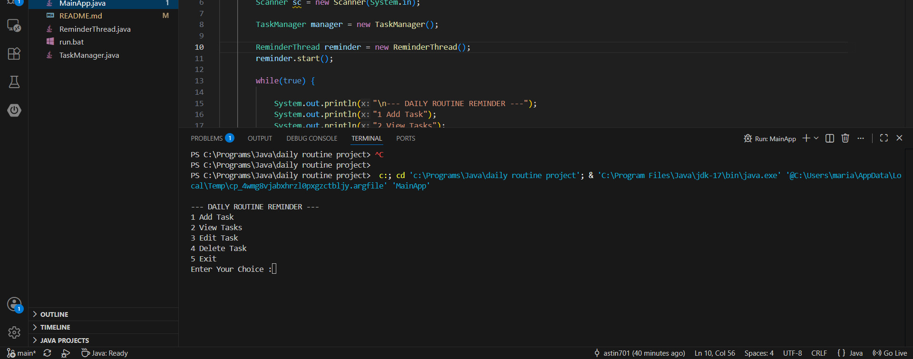
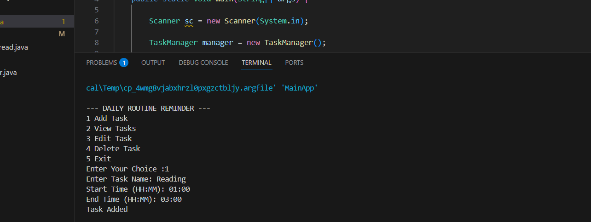
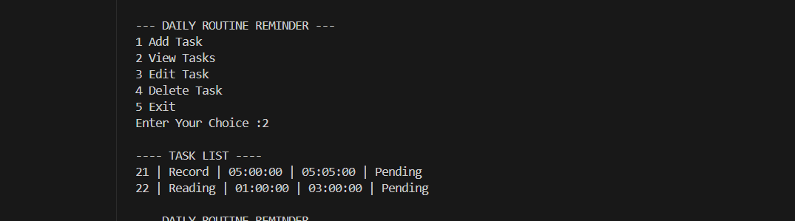
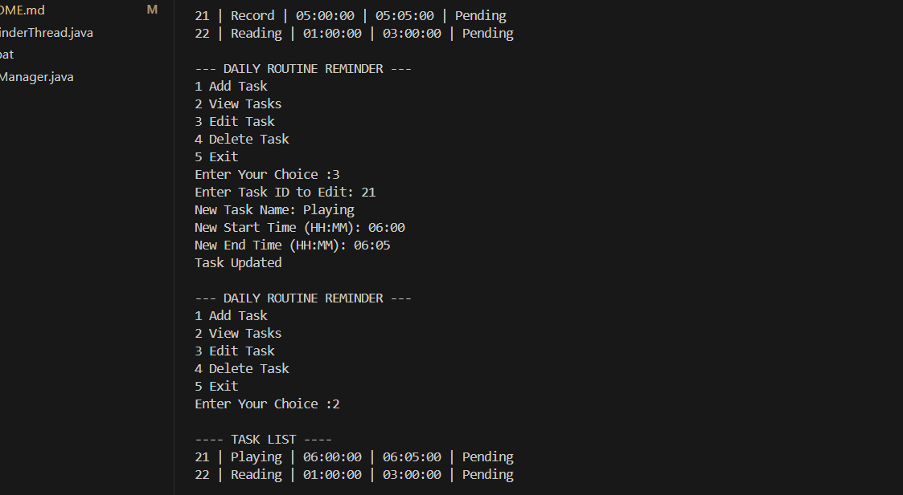
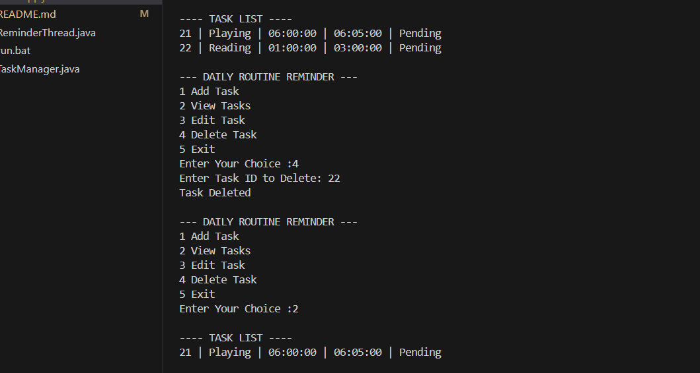

# 📝 Daily Routine Project

A Java-based console application that helps users organize their daily tasks and receive reminders. This project demonstrates Java programming concepts including Object-Oriented Programming (OOP), Multithreading, JDBC, and MySQL database integration.

---

## 🚀 Features

- ✅ Add new daily tasks
- 📋 View all tasks
- ✏️ Edit existing tasks
- 🗑️ Delete tasks
- ⏰ Reminder notifications using multithreading
- 💾 Store tasks in MySQL database
- 📌 Console-based interactive menu

---

## 🛠️ Technologies Used

- Java
- JDBC
- MySQL
- Object-Oriented Programming (OOP)
- Multithreading
- VS Code

---

## 📂 Project Structure

```
Daily Routine Project/
│
├── MainApp.java
├── TaskManager.java
├── ReminderThread.java
├── DBConnection.java
├── run.bat
└── lib/
```

---

## 📸 Application Menu

```
----- DAILY ROUTINE REMINDER -----

1. Add Task
2. View Tasks
3. Edit Task
4. Delete Task
5. Exit
```

## 📷 Screenshots

### Main Menu


### Add Task


### View Tasks


### Edit Task


### Delete Task


### Reminder Notification


---

## ⚙️ Installation

### 1. Clone the repository

```bash
https://github.com/astin701/daily-routine-project.git
```

### 2. Open the project in VS Code

### 3. Create a MySQL database

Example:

```sql
CREATE DATABASE daily_routine;

USE daily_routine;

CREATE TABLE tasks (
    id INT AUTO_INCREMENT PRIMARY KEY,
    task_name VARCHAR(100),
    start_time TIME,
    end_time TIME,
    status VARCHAR(20),
    task_date DATE
);

```

### 4. Update database credentials

Edit the `DBConnection.java` file.

```java
String url = "jdbc:mysql://localhost:3306/daily_routine";
String username = "root";
String password = "your_password";
```

### 5. Run the application

Compile and run:

```bash
javac *.java
java MainApp
```

---

## 💡 Concepts Demonstrated

- Java Classes & Objects
- Encapsulation
- Collections
- Exception Handling
- JDBC Database Connectivity
- CRUD Operations
- Multithreading
- Console Application Development

---

## 🎯 Future Improvements

- Java Swing GUI
- JavaFX Desktop Interface
- Email Notifications
- SMS Reminders
- Calendar Integration
- Task Categories
- Priority Levels
- User Login System

---

## 👨‍💻 Author

**Maria Astin**

Java Full Stack Developer


LinkedIN :https://www.linkedin.com/in/maria-astin-a0907125b/

GitHub: https://github.com/astin701

---

## ⭐ Support

If you found this project useful, consider giving it a ⭐ on GitHub.

Feedback and suggestions are always welcome!